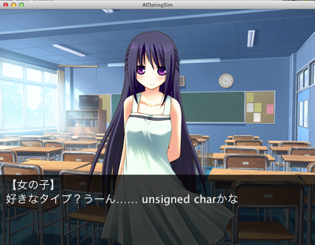
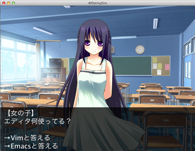

AI-COMPが送る本格恋愛シミュレーションゲーム

# [ここにAIと愛を絡めた感じの上手いタイトルが入る]

ここは、プログラミングに力を入れている鷲崎大学
今年入学したある女の子にあなたは一目惚れします。
しかし、その子はあなたの他に3人の男性から狙われているようです。
いち早く仲良くなって、彼女との愛を手に入れることができるのは誰でしょう。

## ゲームの目的
その女の子に告白してOKを貰うこと、もしくは女の子から告白されることを目指します。

## プレイヤーキャラクター

このゲームは四人対戦のゲームです。あなたは四人の登場人物の中のどれかになり、
その女の子と仲良くなることを目指します。

キャラクターは最初に決められ、
初期パラメータ、イベントのシチュエーションが若干異なりますが
特にゲーム進行に変化はありません。

### プレイヤー1
関係：同級生

入学して同じクラスになった同級生
その女の子に近づく機会は最も多く、仲良くなりやすいが、それは恋愛感情へと昇華されるのだろうか。

### プレイヤー2
関係：チームメイト

女の子と部活のチームを組んで練習し、夏の予選と冬の大会を目指すが、
プライベートでも仲良くなりたいと考えている。
キャラクターのスキルが好感度に大きく影響する。

### プレイヤー3
関係：部活の先輩

仲良くなるまでの女の子と出会える機会がプレイヤーキャラクター中最も少ないが、
経験豊富そうな雰囲気はその女の子からの尊敬を受けることができる
 
### プレイヤー4
関係：幼なじみ

説明
幼い頃に遊んでいて、小学校に入学する時に離ればなれになってしまったが、
高校に入学して再会を果たしました。
好みを聞かずになく「思い出す」ことが出来る唯一のキャラクターで、
うまく会話に出すことで女の子に特別な縁を感じてもらえるかもしれない。

## 女の子

鷲崎高校の一年生
好みははっきりとしており、好き嫌いも多いが、
あまり口に出すことはない。
話が合わない人や尊敬出来る点の無い人とは付き合えないと考えている。

## 性格システム

女の子の性格や好みはゲームごとに変化し、その情報は隠されているため
あなたは最初、その女の子のことについて何も知ることができません。

会話で尋ねたりデートの反応を見ることで、欲しいものや好みのタイプなどを掴んでいき、
彼女についての情報が増えていったらそれをうまく活用し、
地雷を踏まないように気をつけながら、話題を出すことでより仲良くなったり
好まれる相手になるようスキルを磨いたりしよう。

## 普段の行動
女の子と行動をともにすることや、偶然出会ったりすることもあるが、
一人で行動することの方が多い。
自分自身のスキルが上がったり、お金が増える。

選択可能な行動はAPIによって取得出来る。

選択可能な行動（例）

* 部活の練習
* 学習
* 開発
* バイト
* デートの下見

## アクション
女の子と関わる行動。日々の行動やイベントによって発生する。
相手のことをよく考えて適切な選択肢をとる必要がある。
シチュエーションは主に6種類に分類出来る。

1. 会話 - 雑談
1. 会話 - 相談
1. 会話 - デートの誘い
1. デート
1. プレゼント
1. 告白

## イベント

時期に応じたイベントや突発的なイベントが発生するが、
もしくはプレイヤースキルによる分岐もしくは、6種類のアクションのどれかに対応する。

詳細は攻略ページや仕様リストを参照。

細かいパラメータはゲーム中でAPIからも取得出来る。